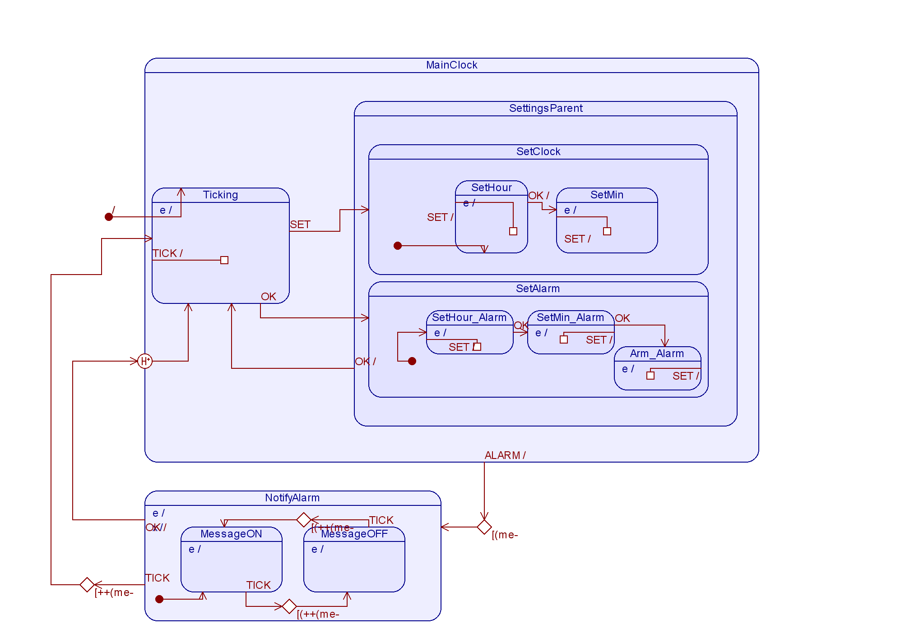
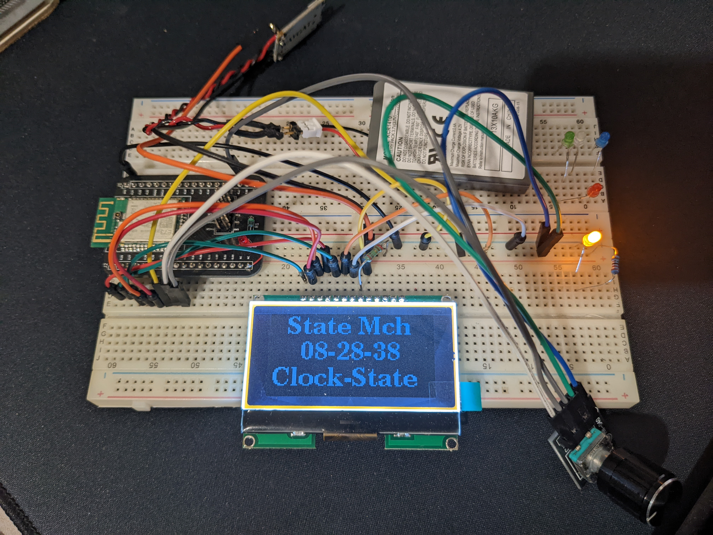
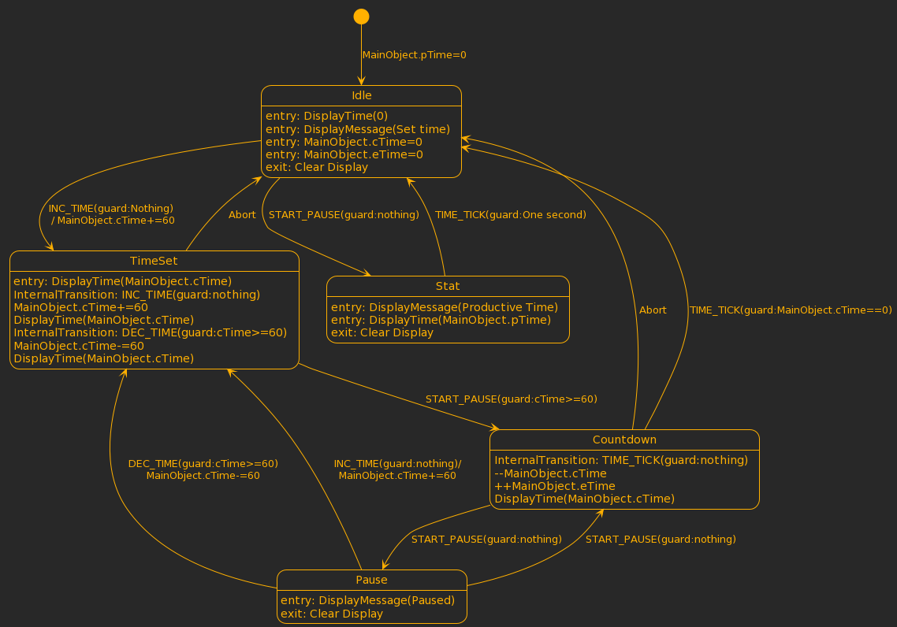

# State-Machine_Implementations

## Flat state machine and Hierarchical state machine implementations

## Hardware used - Custom NRF52832 based hardware - https://github.com/irshad-js/Kicad_NRF_Adaper

## Software used - Zephyr SDK

## Other frameworks used - Quantum Leaps QM and PlantUML

## Demo - 1 : Alarm clock application based on Hierarchical state machine

## Demo - 2 : Kitchen timer application based on flat state machine

